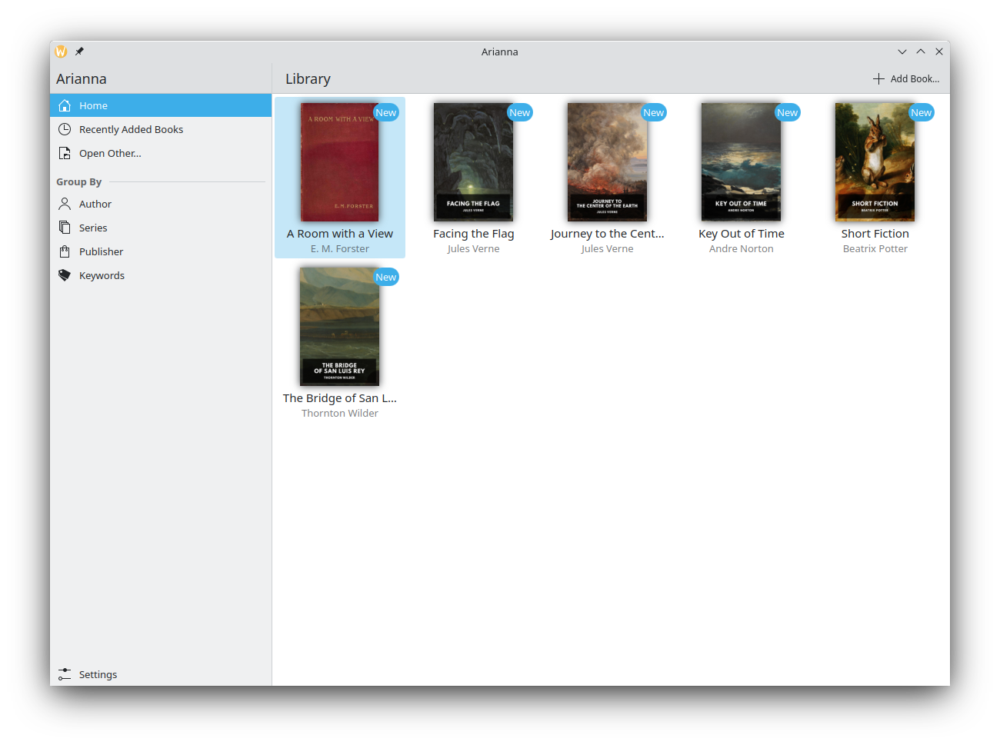
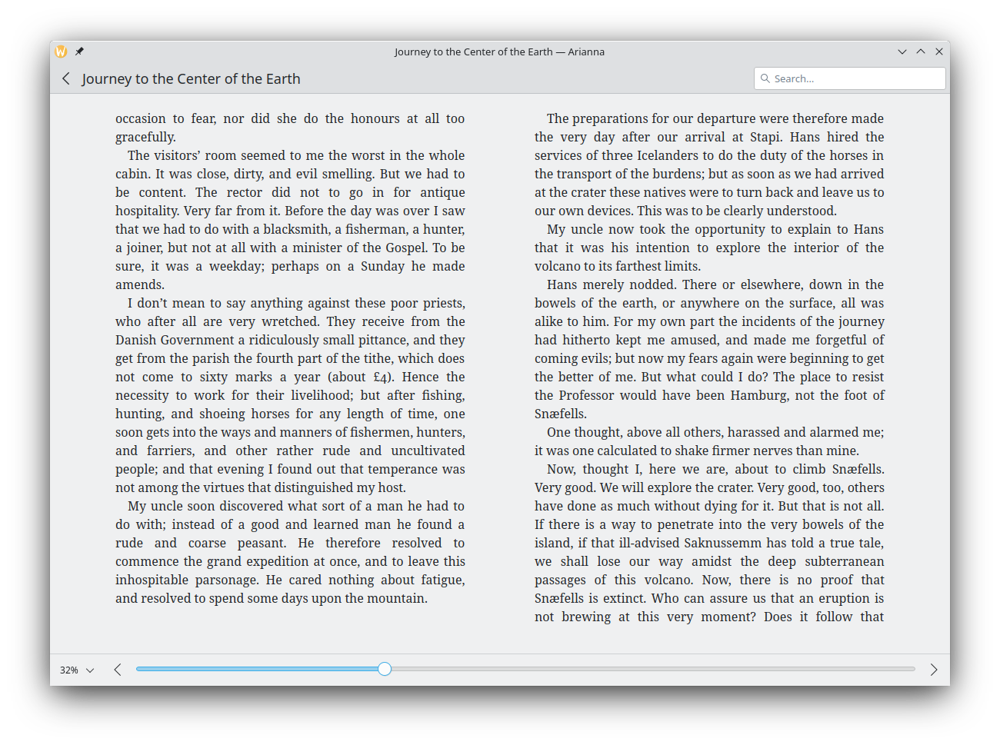

# Arianna

Arianna is an ebook reader.

## Links

* Project page: https://invent.kde.org/graphics/arianna
* File issues: https://bugs.kde.org/describecomponents.cgi?product=arianna
* Matrix chat: #arianna:kde.org [matrix.to](https://matrix.to/#/#arianna:kde.org)

## License

This project is licensed under the GNU General Public License 3.

## Special thanks

- Thanks to the epub.js developers for providing the heavy lifting for viewing epubs
- Thanks to the Foliate developers for the very large inspiration in how to integrate epub.js
- Thanks to Leinir for their work on Peruse from whom the library handling is largely copied
